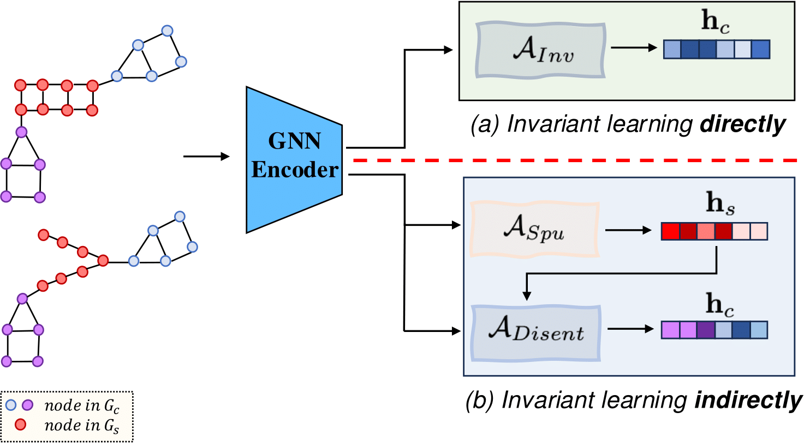

# Learning Graph Invariance by Harnessing Spuriosity
This repository is the official implementation of our paper:

**Learning Graph Invariance by Harnessing Spuriosity**

_Tianjun Yao, Yongqiang Chen, Kai Hu, Tongliang Liu, Kun Zhang, Zhiqiang Shen_

International Conference on Learning Representations 2025 (ICLR2025)

<div align=center>
</div>


## Data
The data used in the experiments can be downloaded from the following sources:

1. SPMotif

Go to `dataset_gen/`, run the following command to generate SPMotif datasets with 3 invariant subgraphs and different bias coefficients:

```bash
python gen_struc.py --bias 0.90 --nb_num 3
```

It will generate a SPMotif dataset with $bias=0.90$ and 3 invariant subgraphs in training and validation sets.

P.S.: To generate datasets for SPMotif, the numpy version must be speficied to 1.20.3, after loading the datasets in PyG, the numpy version should be upgraded to 1.24.3.

2. GOOD datasets

You can follow the instructions [here](https://good.readthedocs.io/en/latest/installation.html) to install the prerequisites for GOOD datsets.

3. OGB datasets

The OGB datasets can be automatically downloaded from the run scripts.


## Running Script

### Running the biased infomax

For the synthetic datasets, the biased infomax can be runned without marking the nodes; For real-world datasets, make sure the results from gsat has already been placed in `explain_res\`.

Then run the following command to start the training:
```
python infomax_GOOD.py --biased --num_layers 5 --epochs 100 --dataset ogbg-molbbbp --device 0 --explain_res_layer 5 --explain_res_topK 8 --explain_res_thres_index 2 --domain size --shift covariate
```

It will run biased infomax to generate spurious embeddings, and save it to `embeddingWritingPath`. Here `--explain_res_layer`, `--explain_res_topK`, and `--explain_res_thres_index` corresponds to the configurations in `explain_res/$dataset$`.

### Run LIRS

Run `run_ood_GOOD.py` for training and evaluation for LIRS. Here is an example.

```
python run_ood_GOOD.py --ood_path ood_results_GOOD/ --intra_cluster_penalty 0.1 --gamma 0.9 --intra_cluster_labels  --num_clusters 3 --nlayers 4 --epochs 100 --dataset ogbg-molbbbp --edge_dim 10 --device 0 --seed 1 --early_stop_epochs 100 --domain size  --shift covariate --spu_emb_path <embedding_path> --fname_str biased_True_explnLayer_5_explnTopK_12_explnThres_1
```
Here, `--spu_emb_path` is the embedding path in `explain_res/`, and `--fname_str` is the output path for the raw results (pytorch tensors or numpy arrays).  One example for `--spu_emb_path`  would be:

`experiment_results/SSL_embedding/ogbg-molbbbp/size/covariate/biased_infomax_True_ignore_False/hidden_dims_64_num_layers_5/expLayer_5_expTopK_12_expThres_1/graph_emb_epoch_60_loss_-29.026.pt`


## Citation
If you find our paper and repo useful, please cite our paper:

```bibtex
@inproceedings{
yao2025learning,
title={Learning Graph Invariance by Harnessing Spuriosity},
author={Tianjun Yao and Yongqiang Chen and Kai Hu and Tongliang Liu and Kun Zhang and Zhiqiang Shen},
booktitle={The Thirteenth International Conference on Learning Representations},
year={2025},
url={https://openreview.net/forum?id=UsVJlgD1F7}
}
```
